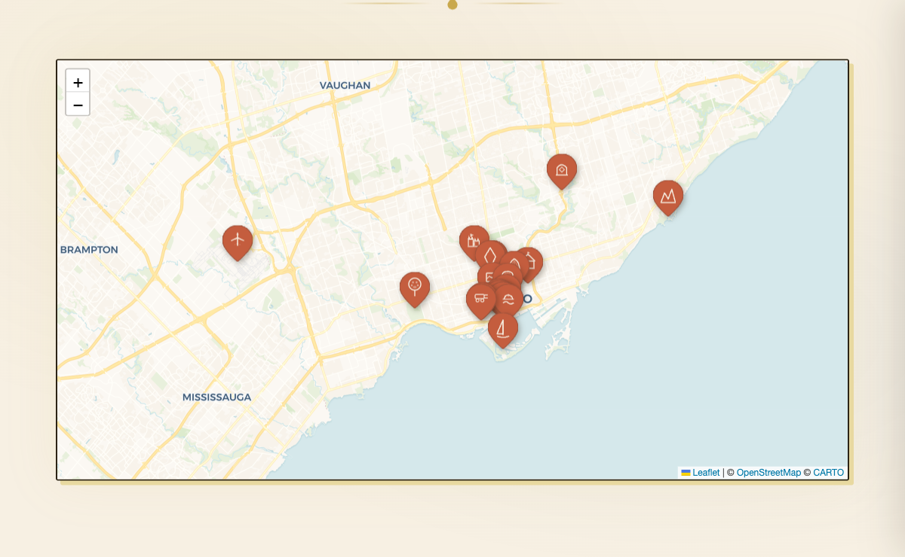

# Discover Toronto

An illustrated, interactive guide to places worth visiting in Toronto — parks, museums, landmarks, and hidden gems — rendered on a real map with hand-drawn pins.

**Live site:** https://discover-toronto.web.app



## What it is

A single-page static site that pairs a geographically accurate [Leaflet.js](https://leafletjs.com/) map with hand-illustrated pin icons and a warm, parchment-style design. Click any pin (or gallery card below the map) to open a detail panel with photos and notes about the location.

Nineteen places are featured, including:

- **Landmarks:** CN Tower, Casa Loma, Union Station, Fort York
- **Museums & galleries:** ROM, AGO, Gardiner, Aga Khan
- **Parks & nature:** Toronto Islands, High Park Zoo, Scarborough Bluffs, Riverdale Farm, Allan Gardens
- **Neighborhoods & venues:** Concord CityPlace, Waterfront, Love Park, Elgin & Winter Garden Theatre
- **Transit:** Pearson Airport, Toronto Railway Museum

## Tech stack

- **Vanilla HTML / CSS / JS** — no build step, no framework
- **[Leaflet.js 1.9.4](https://leafletjs.com/)** for the map
- **[CartoDB Voyager](https://carto.com/basemaps/)** tiles (free, no API key, warm color palette)
- **Custom SVG pin icons** — each location has a unique hand-drawn marker preserved from the original illustrated map
- **[Firebase Hosting](https://firebase.google.com/docs/hosting)** for deployment
- **GitHub Actions** for CI/CD

## Run locally

No build required — it's a static site.

```bash
# Clone
git clone https://github.com/ganjing15/discover-toronto.git
cd discover-toronto

# Option 1: open directly in a browser
open index.html

# Option 2: serve with any static server (recommended — avoids CORS quirks)
python3 -m http.server 8000
# then visit http://localhost:8000

# Option 3: Firebase local preview
npx firebase-tools serve --only hosting
```

## Project structure

```
.
├── index.html       # Markup, pin data (coords + SVG icons), and all JS
├── style.css        # Parchment theme, pin styles, pulse animation, responsive rules
├── firebase.json    # Firebase Hosting config
├── LICENSE          # MIT
└── .github/
    └── workflows/
        ├── firebase-hosting-merge.yml          # Deploys to production on push to main
        └── firebase-hosting-pull-request.yml   # Preview channels for same-repo PRs
```

All data lives inline in [index.html](index.html):

- `placeCoords` — `{ placeId: [lat, lng] }` for each of the 19 pins
- `pinIcons` — per-location SVG markup (unique artwork per place)
- `places` — display data (name, description, image URLs, details)

## Deployment

Production deploys automatically on push to `main` via [firebase-hosting-merge.yml](.github/workflows/firebase-hosting-merge.yml).

The workflow uses a GitHub Environment named `production`, which is gated by required reviewers. This means:

- **Direct pushes by the maintainer** → deploy runs, but must be approved in the Actions tab before it executes.
- **Merged PRs from external contributors** → same gate applies. Code is merged, but deploy does **not** run until approved.

Pull requests from the same repo get a Firebase preview channel URL posted as a comment. PRs from forks skip the preview deploy (fork-safe — no secrets exposed).

## Contributing

Contributions are welcome — new places, better pin art, design tweaks, accessibility improvements.

1. Fork the repo
2. Create a branch (`git checkout -b feature/add-high-park-tea-room`)
3. Commit your changes
4. Open a PR against `main`

For adding a new place, you'll need to:

- Add an entry to `placeCoords` with accurate `[lat, lng]`
- Add an entry to `pinIcons` with the SVG markup for the marker
- Add an entry to `places` with name, description, photos, and details
- Add a matching `.g-card` in the gallery section

Branch protection requires one approving review before merge.

## License

MIT — see [LICENSE](LICENSE).

Map tiles &copy; [OpenStreetMap](https://www.openstreetmap.org/copyright) contributors &copy; [CARTO](https://carto.com/attributions).
